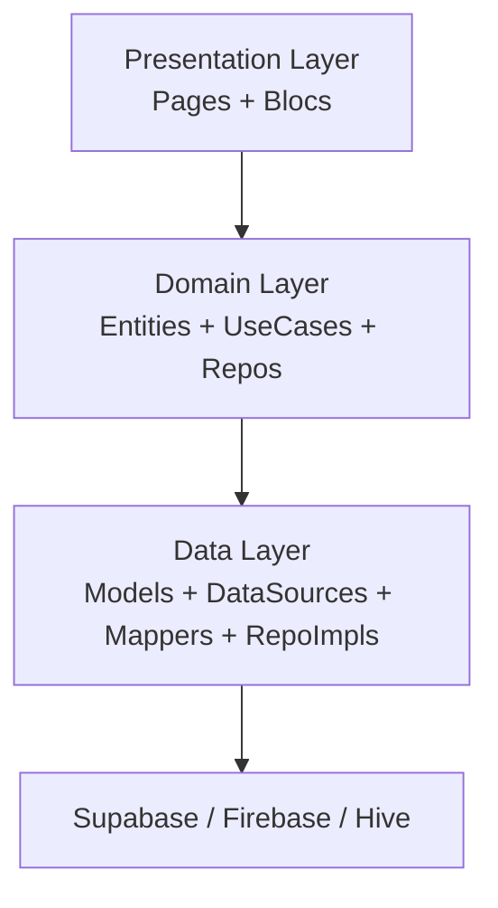
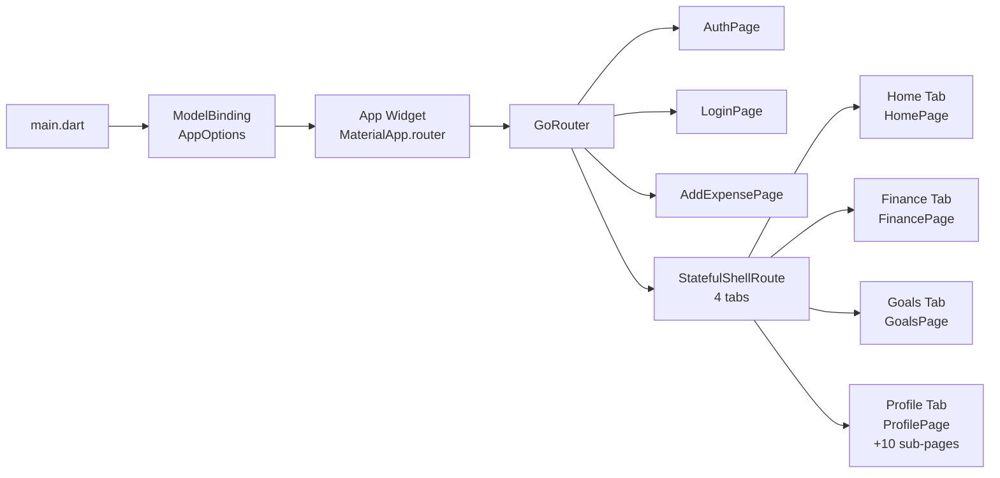

# 📊 Expense Pro — To'liq Loyiha Tahlili

## 1. Loyiha haqida umumiy ma'lumot

| Maydon | Qiymat |
|--------|--------|
| **Nomi** | expense_pro |
| **Versiya** | 1.0.0+1 |
| **Flutter SDK** | >=3.10.0 <4.0.0 |
| **Platforma** | Android, iOS, Web, macOS, Linux, Windows |
| **Font** | Manrope (400/500/700), Poppins (500/700) |
| **Backend** | Supabase + Firebase (Remote Config, Crash, Push) |

---

## 2. Arxitektura

Loyiha **Clean Architecture** + **BLoC pattern** asosida qurilgan:



Har bir feature quyidagi tuzilmaga ega:
```
feature/
  ├── data/
  │   ├── data_source/
  │   ├── mapper/
  │   ├── models/
  │   └── repositories/
  ├── domain/
  │   ├── entities/
  │   ├── repositories/    ← abstract
  │   └── usecases/
  └── presentation/
      ├── blocs/
      └── pages/
```

---

## 3. Feature Modullari

| Feature | Sahifalar / Funksiyalar |
|---------|------------------------|
| **auth** | `AuthPage`, `LoginPage` — autentifikatsiya oqimi |
| **home** | `HomePage`, `HomeDescription` — asosiy dashboard |
| **finance** | `FinancePage`, `FinanceDescriptionPage` — moliya ma'lumotlari |
| **goals** | `GoalsPage`, `GoalsDescriptionPage` — moliyaviy maqsadlar |
| **add_expense** | `AddExpensePage` — xarajat qo'shish |
| **profile** | 11 ta sahifa (profil, sozlamalar, til, mavzu, bildirishnomalar, yutuqlar, odatlar kuzatuvchisi, obunalar, user info, avtomatlashtirish, ilova haqida) |
| **main** | `MainPage` — bottom navigation shell |

---

## 4. Navigatsiya (GoRouter)

`StatefulShellRoute.indexedStack` — 4 ta tab bilan:

```
/home          ← HomePage
  /home-description

/finance       ← FinancePage
  /finance-description

/goals         ← GoalsPage
  /goals-description

/profile       ← ProfilePage
  /settings
  /achievements
  /notifications
  /habits
  /subscription
  /language
  /theme
  /user-info
  /automations-rules
  /about-application
```

Alohida (modal/stack) sahifalar:
- `/auth` — Auth page
- `/login` — Login page
- `/add-expense` — Xarajat qo'shish

> [!NOTE]
> `initialLocation` = `/home`. Auth guard mavjud emas — foydalanuvchi to'g'ridan-to'g'ri home-ga tushadi.

---

## 5. Core Modullari

| Modul | Maqsad |
|-------|--------|
| `common/` | Umumiy widgetlar va yordamchilar |
| `connectivity/` | Internet ulanish holati (NetworkInfo) |
| `database/` | Hive — lokal saqlash (LocalSource) |
| `di/` | GetIt + Injectable DI konteyneri |
| `enums/` | Ilovada ishlatiladigan enum turlari |
| `errors/` | Failure / Exception klasslari |
| `extensions/` | BuildContext va boshqa extension metodlar |
| `functions/` | Yordamchi funksiyalar |
| `models/` | AppOptions (mavzu + til) |
| `services/` | AuthInterceptor, LocationService, NotificationService, SmsRetriever |
| `themes/` | AppColor, AppTextStyle, AppTheme (light + dark) |
| `usecase/` | Base UseCase klassi |
| `utils/` | LogBlocObserver va boshqa utility klasslari |

---

## 6. Asosiy Kutubxonalar (Dependencies)

### State Management
- `flutter_bloc: ^9.1.1` + `bloc: ^9.1.0` + `bloc_concurrency: ^0.3.0`

### Navigatsiya
- `go_router: ^17.0.0`

### Backend / Network
- `supabase_flutter: ^2.12.0`
- `dio: ^5.9.0` (HTTP client)
- `chuck_interceptor: 2.2.5` (debug HTTP inspector)
- Firebase: `firebase_core`, `firebase_messaging`, `firebase_crashlytics`, `firebase_remote_config`

### Lokal Saqlash
- `hive: ^2.2.3` + `hive_flutter: ^1.1.0`
- `path_provider: ^2.1.5`

### Localization
- `intl: ^0.20.2` + `flutter_localizations`
- Tillar: **Uzbek (uz)**, **Russian (ru)**, **English (en)**, **French (fr)**

### Code Generation
- `freezed: ^3.2.3` + `json_serializable: ^6.13.0`
- `injectable_generator: ^2.9.1`
- `flutter_gen_runner: ^5.12.0`

### UI / UX
- `cached_network_image: ^3.4.1`
- `flutter_svg: ^2.2.1`
- `shimmer: ^3.0.0`
- `pinput: ^5.0.2` (OTP input)
- `scale_button: ^2.1.2`
- `gap: ^3.0.1`
- `youtube_player_flutter: ^9.1.3`
- `timeago: ^3.7.1`

### Boshqa
- `get_it: ^9.0.5` (DI)
- `equatable: ^2.0.7` (solishtirish)
- `package_info_plus: ^8.3.0`
- `permission_handler: ^12.0.1`
- `url_launcher: ^6.3.2`
- `share_plus: ^11.0.0`
- `image_picker: ^1.2.1`
- `smart_auth: ^3.2.0` (SMS OTP)

---

## 7. Localization (l10n)

- **Fayl formati**: `.arb` (Application Resource Bundle)
- **Fayllari**: `intl_en.arb`, `intl_ru.arb`, `intl_uz.arb` (yoki `intl_fr.arb`)
- **Generator**: `intl_utils` → `lib/generated/l10n.dart`
- **Default til**: hardcode `Locale('uz')` — `app.dart` da

> [!WARNING]
> `app.dart` da `locale: Locale('uz')` hardcode qilingan. `options.locale` ishlatilmayapti. Bu foydalanuvchi til sozlamalarini o'zgartirganida hech narsa o'zgarmasligiga olib keladi.

---

## 8. Tema (Theming)

- Light va dark mavzu qo'llab-quvvatlanadi
- `AppOptions` orqali `themeMode` saqlanadi Hive-da
- `ModelBinding` widget orqali butun ilovaga uzatiladi
- Ranglar: `AppColor` da markazlashtirilgan
- Matn stillari: `AppTextStyle` da markazlashtirilgan (6983 bayt — keng qamrovli)

---

## 9. Firebase holati

> [!WARNING]
> `main.dart` da Firebase initialization **comment qilingan** (blok comment). Firebase Messaging, Crashlytics, Remote Config paketlari `pubspec.yaml` da mavjud, lekin hech biri amalda inicializatsiya qilinmayapti.

---

## 10. Test holati

```
test/
```
> [!CAUTION]
> `test/` papkasi mavjud lekin deyarli bo'sh. Hech qanday unit test, widget test yoki integration test yozilmagan. Bu loyihaning katta zaif tomoni.

---

## 11. Tavsiyalar (To Do)

| # | Muammo | Muhimlik |
|---|--------|----------|
| 1 | `locale` hardcode — `options.locale` ga ulash | 🔴 Yuqori |
| 2 | Firebase inicializatsiya comment qilib qo'yilgan | 🔴 Yuqori |
| 3 | Auth guard (route redirect) yo'q | 🟠 O'rta |
| 4 | Test coverage nol | 🟠 O'rta |
| 5 | `UserOnfoPage` typo (should be `UserInfoPage`) | 🟡 Past |
| 6 | `parofile_page` typo (should be `profile_page`) | 🟡 Past |
| 7 | `chuck_interceptor` release build-da o'chirilishi kerak | 🟠 O'rta |

---

## 12. Arxitektura diagrammasi


